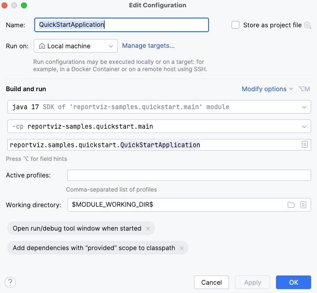

# Samples

This directory contains Spring Boot application samples demonstrating various features of ReportShell.

Most samples are modules of a multi-module Gradle project. There is also a Maven-based quickstart
sample.

## Available Samples

| Sample                                                       | Description                                                                 |
|:-------------------------------------------------------------|:----------------------------------------------------------------------------|
| **[quickstart](quickstart/README.md)**                       | Simplest setup using default configuration.                                 |
| **[maven-quickstart](maven-quickstart/README.md)**           | Quickstart sample for Maven                                                 |
| **[control-defaults](control-defaults/README.md)**           | Demonstrates setting default values for input controls.                     |
| **[custom-data-source](custom-data-source/README.md)**       | Demonstrates using a custom JDBC data source for reports and input controls |
| **[custom-report-store](custom-report-store/README.md)**     | Demonstrates storing report metadata in a database using Spring Data JPA.   |
| **[exporter-registration](exporter-registration/README.md)** | Demonstrates supporting additional export formats                           |
| **[authorization](authorization/README.md)**                 | Demonstrates securing access to reports via Spring Security roles           |

ReportShell Maven packages are published on GitHub packages of this repository. 
For Gradle, build.gradle.kts uses `github.user` and `github.token` properties.
You can set these in your `~/.gradle/gradle.properties` file.

For Maven, you can set your GitHub credentials in your `~/.m2/settings.xml`
as in the following example:

```
<settings>
  <servers>
    <server>
      <id>reportshell</id>
      <username>YOUR_GITHUB_USERNAME</username>
      <password>YOUR_GITHUB_TOKEN</password>
    </server>
  </servers>
</settings>
```

## Running the Gradle Samples

1. **Run a Sample**:
   Open a new terminal window and run the desired sample. For example, to run `quickstart`:
   ```bash
   ./gradlew :quickstart:bootRun
   ```

2. **Access the Application**:
   Once running, the application is typically accessible at `http://localhost:8080`

> **Gradle Dependencies**
>
> Library and plugin dependencies are defined in the **gradle.properties** file

## Running the Maven Quickstart


1. **Run the Sample**:
   Open a new terminal window and run
   ```bash
   ./mvnw -pl maven-quickstart spring-boot:run
   ```

2. **Access the Application**:
   Once running, the application is typically accessible at `http://localhost:8080`

## Running in your IDE:

Many samples use relative file paths to the reports directory based on the assumption that
the working directory of the application (`user.dir` system property) must be the sample's own
folder.

When using IntelliJ IDEA, for example:

If you open this directory as your main Gradle project, and run a sample with a
**Spring Boot Run Configuration**, default working directory would be the root project's folder (
`samples/projects`), that is one level above the expected working directory.
In that case, you can modify the Run Configuration and set working directory to the
macro: `$MODULE_WORKING_DIR$` as in the screenshot below:



## Shared Resources

All sample applications depend on the **[samples-common](samples-common/README.md)** module which
packages shared resources (templates, database init scripts, base Spring configuration, and static
assets) into its JAR.

## PDF Exports
ReportShell auto-detects the presence of the `JRPdfExporter` class and registers it as a supported
exporter when `jasperreports-pdf-X.X.X.jar` is in classpath. All samples add it as a runtime dependency
to support PDF exports.
